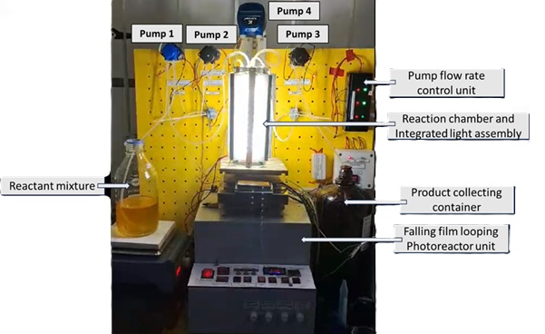

================================================================================
Components of the Automated Batch Stirred Tank Reactor (ABSTR)
================================================================================

Overview
================================================================================

The automated batch stirred tank reactor (ABSTR) is composed of three major functional units, each containing specific hardware and software components. This document provides a detailed breakdown of all reactor components and their specifications for batch-wise automated operation.

1. Falling Film Looping Photoreactor Unit
================================================================================

1.1 Description
--------------------------------------------------------------------------------

The falling film looping photoreactor unit is the core reaction chamber where photochemical transformations occur in batch cycles. This unit combines gravity-driven film formation with internal circulation to maintain uniform reaction conditions throughout the reaction process.

1.2 Primary Components
--------------------------------------------------------------------------------

**Reaction Chamber (Reactor Module)**

- Transparent material (borosilicate glass) for light transmission
- Main vessel where the reaction mixture is held during reaction operations
- Cylindrical geometry designed for continuous falling film operation
- Integrated top inlet manifold for incoming reaction mixture from Pump 1
- Integrated outlet port for product removal via Pump 3
- Integrated inlet port for solvent introduction from Pump 2
- Integrated outlet port for solvent expulsion via Pump 3

**Light Source**

- UV or visible light radiation source positioned outside the chamber wall
- LED arrays can be customized to match the specific wavelength requirements and photochemical reaction conditions
- Light intensity and wavelength optimized for target photochemical transformation

1.3 Inlet and Outlet Ports
--------------------------------------------------------------------------------

**Top Inlet Port (from Pump 1)**

- Connection point for reaction mixture delivery from Pump 1
- Positioned at top of chamber for even distribution

**Product Outlet Port (to Pump 3 - Product Removal)**

- Collection point for product extraction during Step 2 of cycle

**Solvent Inlet Port (from Pump 2)**

- Connection point for washing solvent introduction during Step 3
- Positioned at top of chamber for even solvent distribution

**Solvent Outlet Port (to Pump 3 - Solvent Removal)**

- Expulsion point for solvent removal during Step 4 of cycle

1.4 Thermal Management Components
--------------------------------------------------------------------------------

**Temperature Sensor**

- Real-time temperature monitoring and display
- Accuracy: ±0.5°C or better

**Cooling Fans**

- Enables precise temperature control during batch reactions
- Particularly useful for exothermic reactions or temperature-sensitive processes

2. Automated Batch Operation Control Unit
================================================================================

2.1 Hardware Unit
--------------------------------------------------------------------------------

**Programmable Logic Controller**

- Central control processor executing cyclic batch operations
- Memory capacity for storing multiple batch protocols
- Input/output (I/O) modules for sensor and actuator interfacing
- Real-time clock for cycle timing and synchronization
- Sufficient processing speed for precise cycle timing (millisecond-level accuracy)

**Timer and Sequencer Modules**

- Hardware timers for each operational step (Pump 1, Pump 3, Pump 2, Pump 3 again)
- Cycle counter for tracking number of completed cycles
- Synchronized timing signals to pump controllers
- Watchdog timer for system fault detection

**Control Panel**

- Human-machine interface (HMI) display screen
- Emergency stop button (E-stop)
- Manual on/off switches for individual pumps
- Indicator lights for system status (power, running, alarms)
- USB/Ethernet port for computer connectivity

**Pump Motor Control Electronics**

- Dedicated motor drive controller for each pump (Pump 1, Pump 2, Pump 3)
- Motor overcurrent protection
- Individual enable/disable switching

**Power Supply Unit**

- Regulated AC to DC power converter
- Typical voltage: 14V DC/12V DC
- Capacity: Sufficient to operate all three pumps simultaneously plus control electronics
- Backup power (UPS) for critical control system

2.2 Software Unit
--------------------------------------------------------------------------------

**Batch Cycle Control Logic**

- Sequential state machine for five operational steps
- State transitions:

  - State 1: Idle/Ready
  - State 2: Pump 1 Active (Reaction Mixture Delivery)
  - State 3: Pump 3 Active First Time (Product Removal)
  - State 4: Pump 2 Active (Solvent Introduction)
  - State 5: Pump 3 Active Second Time (Solvent Removal)
  - Return to State 1, and repeat

**Parameter Configuration Module**

- User interface for entering batch parameters
- Input validation to prevent invalid parameter combinations
- Parameters stored in non-volatile memory
- Parameter presets for common reaction types
- Import/export capability for parameter sharing between systems

**Programmable Parameters**

- **Pump 1 Parameters:**

  - Flow rate (mL/min)
  - Calculated delivery time (seconds/minutes)

- **Pump 3 First Activation Parameters (Product Removal):**

  - Extraction duration (seconds/minutes)
  - Flow rate (mL/min)

- **Pump 2 Parameters (Solvent Introduction):**

  - Flow rate (mL/min)
  - Calculated delivery time (seconds/minutes)

- **Pump 3 Second Activation Parameters (Solvent Removal):**

  - Extraction duration (seconds/minutes)
  - Flow rate (mL/min)

- **Cycle Control Parameters:**

  - Cycle hold/reaction time (pause between Pump 1 and Pump 3)
  - Number of cycles (total batches to process)
  - Cycle delay between cycles (seconds)

**Timing and Synchronization**

- Microsecond-level precision for pump switching
- Eliminates overlap between pump operations
- Precise interval timing for automated batch cycles
- Cycle time logging with timestamp accuracy

3. Pump Unit
================================================================================

3.1 Pump 1 (Reaction Mixture Delivery Pump)
--------------------------------------------------------------------------------

**Specifications**

- Type: Peristaltic pump for accurate, low-pulsation delivery
- Flow rate range: 0-40 mL/min (dependent on reactor scale)
- Operating flow rate: Operator-defined (mL/min)
- Fluid compatibility: Compatible with reaction solvents and reagents
- Motor type: DC motor with variable speed capability
- Speed control: 0-100%
- Tubing material: Chemical-resistant (silicone)
- Mounting: Flexible tubing connections with quick-disconnect couplings

**Function During Cycle**

- Activated at cycle start (Step 1)
- Delivers predetermined reaction mixture volume from reagent reservoir
- Supplies continuous flow at specified rate until volume is delivered
- Automatic shutdown upon completion of programmed duration
- No operation during Steps 2, 3, and 4
- Cycle restart initiates Pump 1 again

**Inlet Configuration**

- Suction line connected to reagent reservoir

**Outlet Configuration**

- Discharge line connected to reactor module top inlet port
- Quick-disconnect coupling for rapid changeover

3.2 Pump 2 (Solvent Introduction Pump)
--------------------------------------------------------------------------------

**Specifications**

- Type: Peristaltic pump for metered solvent delivery
- Flow rate range: 0-40 mL/min (dependent on reactor scale)
- Operating flow rate: Operator-defined (mL/min)
- Fluid compatibility: Compatible with washing solvents
- Motor type: DC or AC motor with variable speed capability
- Speed control: 0-100%
- Tubing material: Chemical-resistant (silicone)
- Mounting: Flexible tubing connections with quick-disconnect couplings

**Function During Cycle**

- Inactive during Steps 1 and 2 (reaction phase and product removal)
- Activated during Step 3 for solvent introduction
- Delivers predetermined solvent volume at specified flow rate
- Automatic shutdown upon completion of programmed duration
- Inactive during Step 4 (solvent removal)
- Remains inactive until next cycle

**Inlet Configuration**

- Suction line connected to solvent reservoir

**Outlet Configuration**

- Discharge line connected to reactor module solvent inlet port
- Quick-disconnect coupling for rapid changeover

3.3 Pump 3 (Product and Solvent Removal Pump)
--------------------------------------------------------------------------------

**Specifications**

- Type: Peristaltic pump for gentle product removal without foam
- Flow rate range: 0-40 mL/min (dependent on reactor scale and viscosity)
- Operating flow rate: Operator-defined (mL/min)
- Fluid compatibility: Compatible with reaction products and solvents
- Motor type: DC motor with variable speed capability
- Speed control: 0-100%
- Tubing material: Chemical-resistant (silicone)
- Mounting: Flexible tubing connections with quick-disconnect couplings

**Dual-Function Operation**

- **First Activation (Step 2)**: Product removal from reactor
- **Second Activation (Step 4)**: Solvent removal from reactor

**Function During Cycle - Step 2 (Product Removal)**

- Activated after Pump 1 completes reaction mixture delivery
- Draws product from reactor product outlet port
- Operates for predetermined extraction duration
- Flow directed to product collection vessel
- Automatic shutdown upon completion of programmed time

**Function During Cycle - Step 4 (Solvent Removal)**

- Activated after Pump 2 completes solvent introduction
- Draws solvent from reactor solvent outlet port
- Operates for predetermined extraction duration
- Automatic shutdown upon completion of programmed time

3.4 Looping Pump (Pump 4)
--------------------------------------------------------------------------------

**Specifications**

- Type: Peristaltic pump for recirculation duty
- Flow rate range: Variable (typically 10-1000 mL/min)
- Space-velocity setting: Operator-defined recirculation ratio
- Motor type: DC motor with variable speed controller
- Mounting: Flexible tubing connections

**Function**

- Recirculates reactor effluent back to the top of reaction chamber
- Sustains continuous falling film formation along chamber walls
- Engages automatically at system startup
- Maintains consistent internal circulation throughout reaction

**Tubing and Connections**

- Tubing compatible with reaction medium
- Return line directed to top distributor manifold
- Quick-connect couplings for easy maintenance

3.5 Pump Motor Control and Drive Electronics
--------------------------------------------------------------------------------

**Individual Pump Motor Drivers**

- Three independent motor control modules (one per pump)
- Regulated power at variable levels
- Overcurrent protection

3.6 Power Supply Architecture
--------------------------------------------------------------------------------

**Primary Power Supply**

- Input: 110-240V AC (single-phase) or three-phase industrial supply
- Output: 14V DC and 5V DC regulated for logic and control

**Backup Power System (Optional but Recommended)**

- Uninterruptible Power Supply (UPS) module
- Allows reaction to continue even after power cut

4. Reagent and Collection Systems
================================================================================

4.1 Reagent Reservoir (Reaction Mixture Supply)
--------------------------------------------------------------------------------

**Specifications**

- Capacity: 1-5 L (depending on batch size and cycle duration)
- Material: Glass
- Inlet port: For reagent replenishment with removable cap
- Outlet port: Connected to Pump 1 inlet via tube
- Closure: Sealed cap with desiccant vent to prevent evaporation and contamination

4.2 Solvent Reservoir (Washing Solvent Supply)
--------------------------------------------------------------------------------

**Specifications**

- Capacity: 1-5 L
- Material: Glass
- Inlet port: For solvent replenishment
- Outlet port: Connected to Pump 2 inlet via tube
- Closure: Sealed cap preventing evaporation and contamination

4.3 Product Collection Vessel (Batch Product Container)
--------------------------------------------------------------------------------

**Specifications**

- Capacity: 1-10 L
- Material: Glass
- Connection: Quick-disconnect tubing coupling from Pump 3 product line
- Graduated volume markings: For product quantity monitoring
- Closure: Removable cap or lid with seal

**Labeling and Documentation**

- Product identification labels
- Batch number and date markings
- Reaction type and parameter set identifier
- Collection time start and end

Summary of Key Components
================================================================================

| Component Category | Specific Component | Function |
|---|---|---|
| Reaction Chamber | Falling Film Looping Photoreactor | Main reaction vessel with light source |
| Light Source | LED Array | Provides photochemical energy |
| Control System | PLC  | Automated system control and monitoring |
| Sensors | Temperature | Process parameter monitoring |
| Pumps | Inlet (Pump 1), Washing (Pump 2), Outlet (Pump 3), Looping (Pump 4) | Fluid movement and circulation |
| Motor Drives | PWM Controllers | Pump speed modulation |
| Storage | Reagent Reservoir | Reaction mixture supply |
| Collection | Product Vessel | Product gathering and storage |
| Safety | E-stop, Indicator | System protection and operator safety |