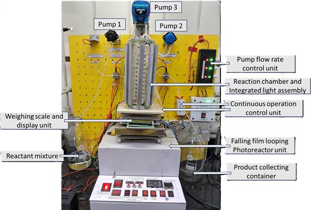

================================================================================
Components of the Continuous Stirred Tank Reactor (CSTR)
================================================================================

Overview
================================================================================

The continuous stirred tank reactor (CSTR) is composed of three major functional units, each containing specific hardware and software components. This document provides a detailed breakdown of all reactor components and their specifications.

1. Falling Film Looping Photoreactor Unit
================================================================================

1.1 Description
--------------------------------------------------------------------------------

The falling film looping photoreactor unit is the core reaction chamber where photochemical transformations occur. This unit combines gravity-driven film formation with internal recirculation to maintain uniform reaction conditions.

1.2 Primary Components
--------------------------------------------------------------------------------

**Reaction Chamber**

- Transparent material (borosilicate glass) for light transmission
- Main vessel where the reaction mixture is held during reaction operations
- Cylindrical geometry designed for continuous falling film operation
- Integrated top inlet manifold for incoming reaction mixture from Pump 1
- Integrated outlet port for product removal via Pump 2
- Internal looping return port for recirculating effluent via Pump 3

**Light Source**

- UV or visible light radiation source positioned outside the chamber wall
- LED arrays can be customized to match the specific wavelength requirements and photochemical reaction conditions
- Light intensity and wavelength optimized for target photochemical transformation

**Internal Looping Recirculation Port**

- Return line from outlet stream directed to the top of the reaction chamber
- Maintains continuous falling film along chamber walls
- Promotes internal circulation and mixing without additional mechanical stirring

1.3 Auxiliary Components
--------------------------------------------------------------------------------

**Thermal Management**

**Temperature Sensor**

- Real-time temperature monitoring and display
- Accuracy: ±0.5°C or better

**Cooling Fans**

- Enables precise temperature control during reactions
- Particularly useful for exothermic reactions or temperature-sensitive processes

2. Continuous Operation Control Unit
================================================================================

2.1 Hardware Unit
--------------------------------------------------------------------------------

**Programmable Logic Controller (PLC)**

- Central control processor executing operational logic
- Input/output (I/O) modules for sensor and actuator interfacing

**Integrated Weighing Scale**

- Load cell integrated beneath or adjacent to reaction chamber
- Real-time mass measurement with ±0.1 g precision
- Continuous signal transmission to control software
- Calibration capability for zero offset and span adjustment

**Temperature Monitoring System**

- Real-time temperature display on control panel
- Accuracy: ±0.5°C or better

**Control Panel**

- 16 x 2 LCD display screen
- Emergency stop button (E-stop)
- Manual on/off switches for individual pumps
- Indicator lights for system status (power, running)
- USB port for computer connectivity

2.2 Software Unit
--------------------------------------------------------------------------------

**Control Logic Software**

- Inlet pump automation routine (Pump 1 engagement)
- Looping pump automation routine (Pump 3 engagement)
- Outlet pump activation logic based on mass threshold W1
- Mass regulation logic maintaining bounds between W1 and W2
- Adaptive pump modulation algorithm

3. Pump Unit
================================================================================

3.1 Inlet Pump (Pump 1)
--------------------------------------------------------------------------------

**Specifications**

- Type: Peristaltic for accurate low-pulsation delivery
- Flow rate range: Variable (typically 0-40 mL/min depending on reactor scale)
- Operating flow rate: x mL/min (operator-defined)
- Fluid compatibility: Compatible with reaction solvents and reagents
- Motor type: DC motor with variable speed controller
- Mounting: Flexible tubing connections for easy installation

**Function**

- Delivers reaction mixture from reagent reservoir into reaction chamber
- Maintains constant inlet flow rate as programmed in control software
- Receives activation signal from PLC at system startup
- Halts operation when chamber mass exceeds upper threshold W2

**Tubing and Connections**

- Chemical-resistant tubing (silicone)
- Quick-connect couplings for rapid changeover

3.2 Outlet Pump (Pump 2)
--------------------------------------------------------------------------------

**Specifications**

- Type: Peristaltic pump for controlled withdrawal
- Flow rate range: Variable (typically 1-40 mL/min)
- Operating flow rate: x mL/min (matched to inlet pump)
- Motor type: DC motor with variable speed controller
- Mounting: Flexible tubing connections

**Function**

- Withdraws product from reaction chamber at controlled rate
- Activated only when chamber mass reaches lower threshold W1
- Maintains equal flow rate with inlet pump during steady-state operation
- Halted when chamber mass exceeds upper threshold W2

**Tubing and Connections**

- Chemical-resistant tubing compatible with product stream
- Quick-connect couplings for collection vessel attachment

3.3 Looping Pump (Pump 3)
--------------------------------------------------------------------------------

**Specifications**

- Type: Peristaltic pump for recirculation duty
- Flow rate range: Variable (typically 10-1000 mL/min)
- Space-velocity setting: Operator-defined recirculation ratio
- Motor type: DC motor with variable speed controller
- Mounting: Flexible tubing connections

**Function**

- Recirculates reactor effluent back to the top of reaction chamber
- Sustains continuous falling film formation along chamber walls
- Engages automatically at system startup
- Maintains consistent internal circulation throughout reaction

**Tubing and Connections**

- Tubing compatible with reaction medium
- Return line directed to top distributor manifold
- Quick-connect couplings for easy maintenance
- Distributor head for uniform liquid dispersal

3.4 Pump Drive and Control Electronics
--------------------------------------------------------------------------------

**Motor Drive Electronics**

- PWM controller for each pump
- Surge current protection

**Power Supply**

- Regulated DC power supply for motor operation
- Backup power (UPS) for critical control systems (optional)
- Sufficient capacity to operate all three pumps simultaneously

**Motor Control Signals**

- Digital on/off signals from PLC to motor relays
- Analog speed control signals

4. Sensor and Instrumentation Package
================================================================================

4.1 Mass Measurement
--------------------------------------------------------------------------------

- Integrated load cell or bench scale: ±0.1 g resolution
- Tare capability and continuous calibration verification
- Real-time signal transmission to PLC

4.2 Temperature Monitoring
--------------------------------------------------------------------------------

- Temperature sensor
- Accuracy: ±0.5°C

5. Reagent and Collection Systems
================================================================================

5.1 Reagent Reservoir
--------------------------------------------------------------------------------

- Holding vessel for reaction mixture supply
- Capacity: 0-5 L (depending on reaction duration and scale)
- Sealed cover to prevent evaporation and contamination
- Outlet port connected to Pump 1 inlet tubing

5.2 Product Collection Vessel
--------------------------------------------------------------------------------

- Receiving container for reactor outlet stream
- Capacity: 0-10 L (dependent on batch reaction time)
- Graduated volume markings for product quantity monitoring
- Connection port linked to Pump 2 outlet tubing
- Cover to prevent product contamination or evaporation

6. Safety and Auxiliary Components
================================================================================

6.1 Safety Systems
--------------------------------------------------------------------------------

**Emergency Stop (E-stop)**

- Easily accessible push-button on control panel
- Immediately halts all pump operations
- Cuts power to motor drives

**Overfill Protection**

- Indicator when chamber mass approaches W2
- Automatic inlet pump shutdown at upper mass limit

6.2 Auxiliary Equipment
--------------------------------------------------------------------------------

**Tubing and Fittings**

- Chemical-resistant tubing: silicone
- Quick-connect couplings for rapid assembly/disassembly

Summary of Key Components
================================================================================

| Component Category | Specific Component | Function |
|---|---|---|
| Reaction Chamber | Falling Film Looping Photoreactor | Main reaction vessel with light source |
| Light Source | LED Array | Provides photochemical energy |
| Control System | PLC | Automated system control and monitoring |
| Weighing | Load Cell | Real-time mass measurement |
| Sensors | Temperature | Process parameter monitoring |
| Pumps | Inlet (Pump 1), Outlet (Pump 2), Looping (Pump 3) | Fluid movement and circulation |
| Motor Drives | PWM Controllers | Pump speed modulation |
| Storage | Reagent Reservoir | Reaction mixture supply |
| Collection | Product Vessel | Product gathering and storage |
| Safety | E-stop, Indicator | System protection and operator safety |