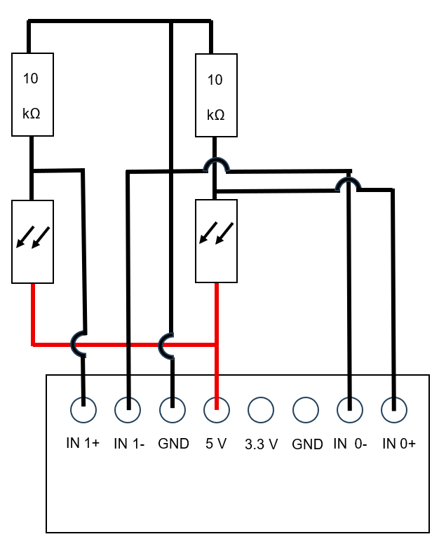
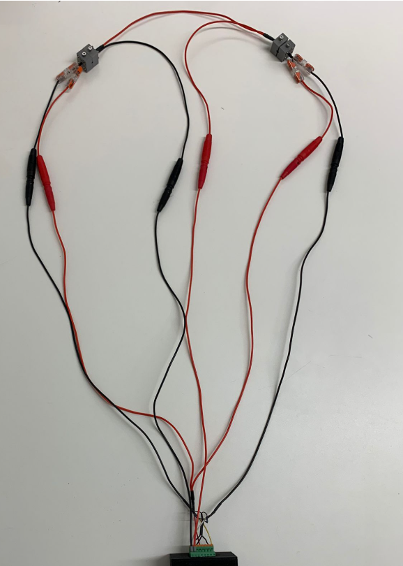

Residence Time Distribution Measurement Cell
============================================

Required 3D-Printed Components
---------------------------------------------------

The following components were 3D-printed using PLA. Click to download the respective STL files from the `CAD repository <../../../../00_CAD/>`_:
-   2x Analytic cells (2 LED halfcells, 2 photoresistor halfcells) consisting of:
   -   `1 mm tubing top <../../../../00_CAD/base_plate.stl>`_
   -   `1 mm tubing bottom <../../../../00_CAD/base_plate.stl>`_
   -   `2 mm tubing top <../../../../00_CAD/base_plate.stl>`_
   -   `2 mm tubing bottom <../../../../00_CAD/base_plate.stl>`_
   -   `3 mm tubing top <../../../../00_CAD/base_plate.stl>`_
   -   `3 mm tubing bottom <../../../../00_CAD/base_plate.stl>`_
-   `base plate bricklet casing <../../../../00_CAD/base_plate.stl>`_
-   `Master extension casing <../../../../00_CAD/case_master_extension.stl>`_
-   `RTD cell extension casing <../../../../00_CAD/case_RTD_cell_extension.stl>`_

Required Hardware Components
-------------------------------

.. figure:: ../_static/figures/RTD_cell/bricklets.png
   :alt: Required Bricklets.
   :align: center
   :width: 90%
 
- :ref:`Master brick <master_brick_3_2>`
- :ref:`Industrial Analog Out Bricklet 2.0 <industrial_analog_out_bricklet_2_0>`
- :ref:`Industrial Dual Analog In Bricklet <industrial_dual_analog_in_bricklet_2_1>`
-	USB-A to USB-C cable
- :ref:`2x LEDs <led>`
- :ref:`2 x photoresistors <photoresistor>`
- :ref:`2x resistors (10 kΩ) <resistor>`
- :ref:`M3 screws and nuts <m3_set_M3_screw_set>`
   (2x Connections between in/out and master brick, 2x small screws for the top of the analytic cells (M3), 8x screws for the sides of the analytic cells (M3), 8x Nuts (+2x nuts in the analytic halfcells for the LEDs))
- :ref:`M3 nylon spacer <nylon_spacer>`
- :ref:`electrical wire (preferably in 2 different colors) <silicone_wire>`
- :ref:`Banana 4 mm coupling <banana_plug_female>`
- :ref:`Banana 4 mm plug (preferably in 2 different colors) <banana_plug_male>`
- :ref:`Wago connectors for photoresistors, resistors and electrical wires <wago_connectors>`

Assembly Instructions
------------------------

.. figure:: ../_static/figures/RTD_cell/Cell_components.png
   :alt: Components for connecting the analytic cells.
   :align: center
   :width: 90%

   Figure 1: Components for connecting the analytic cells.

1. Put the LEDs in the LED halfcells on the outside of the cells (backside of the cells in the figure).
2. Screw one of the small screws on the top of the LED halfcell to fix the LED in the cell. (Make sure a nut is placed in the slid of the halfcell).
3. Put the photoresistors in the photoresistor half cells (photoresistor in the whole, wires to the outside of the cell).
4. Use the bigger screws to fix one LED to a photoresistor halfcell and repeat with the other cells.

.. figure:: ../_static/figures/RTD_cell/bricklets.png
   :alt: Bricklets for the setup
   :align: center
   :width: 90%

   Figure 2: Bricklets for the setup

5. Connect the photoresistors to the industrial dual analog in bricklet as shown in Figure 2 with the electrical wires. 
   Make sure to separate the wires apart from the shown connections using the through connectors and/or electrical insulating tape.

   Figure 3: Sketch on how to connect the photoresistors to the bricklet.

6. Connect the LEDs to the industrial analog out bricklet as shown in Figure 3 with the electrical wires.

.. figure:: ../_static/figures/RTD_cell/LEDs.png
   :alt: Sketch on how to connect the LEDs to the bricklet.
   :align: center
   :width: 90%

   Figure 4: Sketch on how to connect the LEDs to the bricklet.

.. figure:: ../_static/figures/RTD_cell/cables.png
   :alt: Cables to connect the bricklets.
   :align: center
   :width: 90%

   Figure 5: Cables to connect the bricklets.

7. Connect the industrial dual analog in and the industrial analog out bricklets to the master brickletr using the Plug cable 7P-10P (note that dependent on the generation of the used Tinkerforge components a Plug cable 7P-7P might be required.

The setup should look like this afterwards:

   Figure 6: Example setup.

Operation
------------

Setup
^^^^^^^^

First the setup needs to be connected to a PC with the USB-A to USB-C cable.
For the residence time distribution measurements, one cell has to be fixed on the capillary before and one after the reactor.
As a tracer for the measurement, Methylene Blue with a concentration of 1 g/L for an aqueous system or 0.8 g/L in acetonitrile is suggested.

Code 
^^^^^^

To operate the setup, the RTD cell operating script `rtd_cell_control.py <../../../02_Software/02_RTD_Cell_Control.py>`_ is required.

Note that for the operation of the TInkerforge components the `Brick Deamon <https://www.tinkerforge.com/de/doc/Software/Brickd.html>`_ is required.

Make sure all needed packages for the code are installed and the UID for industrial analog in and out in the code is changed to the once used in the setup.
The UIDs for industrial analog in and out can be checked with `Brick Viewer <https://www.tinkerforge.com/de/doc/Software/Brickv.html>`_, once the setup is connected to the PC.
To open the measurement window, run the code.
The following window should open:

.. figure:: ../_static/figures/RTD_cell/Measurement_window.png
   :alt: Measurement window.
   :align: center
   :width: 90%

   Figure 7: Measurement window.

Before measurement can start the LEDs must be turned on for at least 60 sec. by pressing "Start LED".
This is to ensure a stable signal from the photoresistors before measurements start.
Clicking "Start Measurement" will start the Liveplot and the "Save data" button allows to save the data from the measurement.

