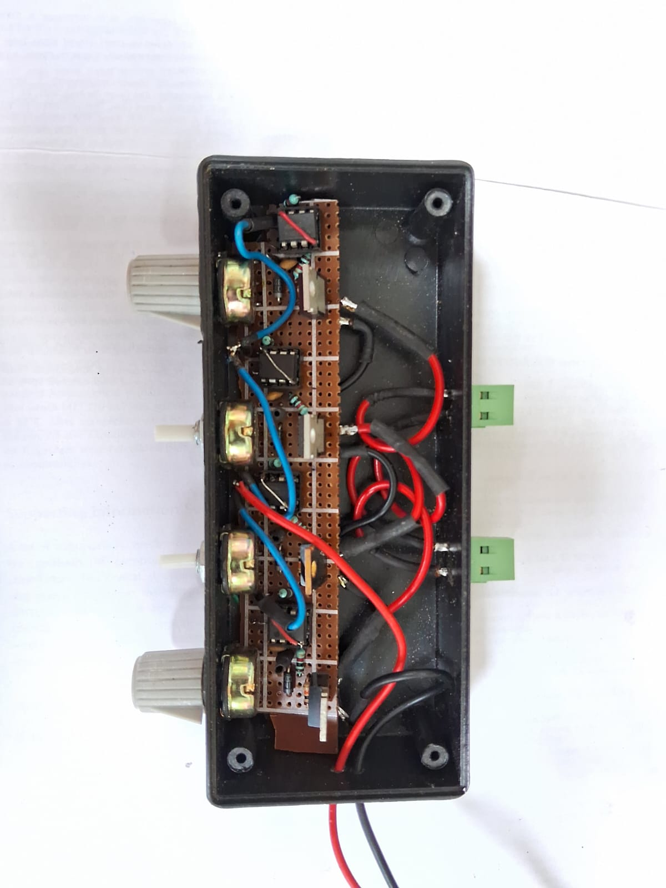
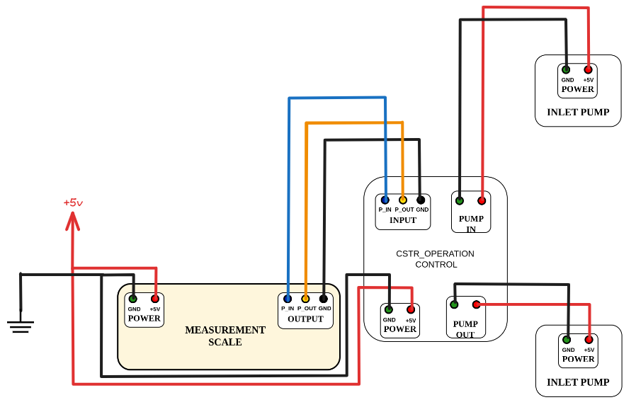

Continuous Batch Stirred Tank Reactor (CSTR)
============================================

OVERVIEW
--------
The continuous batch stirred tank reactor (CSTR) is a software-assisted system designed to operate continuously while maintaining controlled flow rates and stable reactor volume. It uses dedicated inlet, outlet, and looping pumps to regulate mass, recirculate reactor effluent, and sustain a falling-film stirring environment. Through predefined flow parameters and dynamic feedback from an integrated weighing scale, the control software modulates pump operation to keep the reactor mass within target limits. Adjustable experimental settings allow the system to be optimized for different reaction conditions, ensuring stable, scalable, and efficient continuous operation.

.. figure:: ../../../_static/shibu_figure/cstr_cmplt.jpeg
   :alt: complete image
   :width: 300px
   :align: center

   Figure 1: Complete diagram of the machine

MODULES USED
------------

:doc:`Measurement Module<../modules/weigh_scale>`

.. figure:: ../../../_static/shibu_figure/weigh_scale.jpeg
   :alt: Measurement Module
   :width: 300px
   :align: center

:doc:`Power Supply <../components/12V_10A_powersupply>`

.. figure:: ../../../_static/shibu_figure/powersupply.png
   :alt: power supply module
   :width: 300px
   :align: center

:doc:`PUMP SPEED CONTROLLER <../modules/pump_controller>`

:doc:`Transit Circuit <../modules/transit_ckt>`

.. figure:: ../../../_static/shibu_figure/transit_ckt.jpeg
   :alt: transit circuit module
   :width: 300px
   :align: center

:doc:`CSTR OPERATIONAL CKT <../modules/cstr_operational_ckt>`

.. figure:: ../../../_static/shibu_figure/cstr_operation_control.jpeg
   :alt: cstr operational circuit
   :width: 300px
   :align: center

:doc:`Low Flow Peristaltic Pump <../components/perisstalticpump_lowflow>`

.. figure:: ../../../_static/shibu_figure/peristaltic_pump.png
   :alt: low flow peristaltic pump
   :width: 300px
   :align: center

:doc:`High Flow Peristaltic Pump <../components/peristalticpump_highflow>`

.. figure:: ../../../_static/shibu_figure/peristaltic_pump.png
   :alt: high flow peristaltic pump
   :width: 300px
   :align: center

Assembly Instruction
--------------------

1.Connect the Power of the measurement scale with the adapter

2.connect the output of the measurement scale with the input of the cstr operational circuit according to block diagram below

3.connect the power of the cstr operational module.

4.connect the inlet and outlet pump with the cstr operational circuit according to the block diagram below.

5.Connect the ground of all the modules to form a common ground.

6. Refer to the block diagram provided below for a clearer understanding of the overall system architecture and signal flow.

7. Upload the arduino code given below after adjusting the parameters required for the weighing scale and pumps.

Block Diagram
-------------

   Figure: Block diagram of CSTR circuit

Arduino Code for CSTR
---------------------

.. code-block:: cpp
   :linenos:

   #include <HX711_ADC.h>
   #include <Wire.h>
   #include <LiquidCrystal_I2C.h> // LiquidCrystal_I2C library

   HX711_ADC LoadCell(4, 5);  // dt pin, sck pin
   LiquidCrystal_I2C lcd(0x27, 16, 2); // LCD HEX address 0x27

   int taree = 6;
   int a = 0;
   float b = 0;
   int inlet = 7;
   int outlet = 8;

   int max = 20.5 // set the maximum weight of the reactant
   int min = 19.5 // set the minimum weight of the reactant

   void setup() {
      pinMode(inlet, OUTPUT);
      pinMode(outlet, OUTPUT);
      pinMode(taree, INPUT_PULLUP);

      LoadCell.begin(); // start connection to HX711
      LoadCell.start(1000); // load cells get 1000ms of time to stabilize

      ///////////////////////////////////////////
      LoadCell.setCalFactor(375); // Calibrate your LOAD CELL with 100g weight,
                                 // and change the value according to readings
      ///////////////////////////////////////////

      // initialize the LCD
      lcd.begin();      // begins connection to the LCD module
      lcd.backlight();  // turns on the backlight
      lcd.setCursor(1, 0); // set cursor to first row
      lcd.print("Digital Scale "); // print out to LCD
      lcd.setCursor(0, 1); // set cursor to first row
      lcd.print(" SHIBU NASKAR "); // print out to LCD
      delay(3000);
      lcd.clear();
   }

   void loop() {
      lcd.setCursor(1, 0); // set cursor to first row
      lcd.print("Digital Scale "); // print out to LCD

      LoadCell.update(); // retrieves data from the load cell
      float i = LoadCell.getData(); // get output value

      if (i < 0) {
         i = i * (-1);
         lcd.setCursor(0, 1);
         lcd.print(" ");
         lcd.setCursor(8, 1);
         lcd.print(" ");
      } else {
         lcd.setCursor(0, 1);
         lcd.print(" ");
         lcd.setCursor(8, 1);
         lcd.print(" ");

         lcd.setCursor(1, 1); // set cursor to second row
         lcd.print(i); // print out the retrieved value to the second row
         lcd.print("g ");
         float z = i / 28.3495;
         lcd.setCursor(9, 1);
         lcd.print(z, 2);
         lcd.print("oz ");

         if (i > 5000) {
               i = 0;
               lcd.setCursor(0, 0); // set cursor to second row
               lcd.print(" Over loaded ");
               delay(200);
         }

         if (i > max) {
               digitalWrite(outlet, HIGH);
               delay(10);
               digitalWrite(inlet, LOW);
               delay(800);
         } else if (i < min) {
               digitalWrite(inlet, HIGH);
               delay(10);
               digitalWrite(outlet, LOW);
               delay(800);
         } else if (i >= min && i <= max) {
               digitalWrite(outlet, HIGH);
               digitalWrite(inlet, HIGH);
               delay(800);
         } else {
               digitalWrite(outlet, LOW);
               digitalWrite(inlet, LOW);
               delay(800);
         }
      }
   }