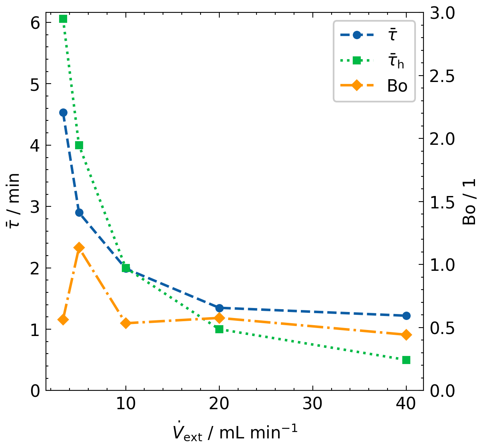
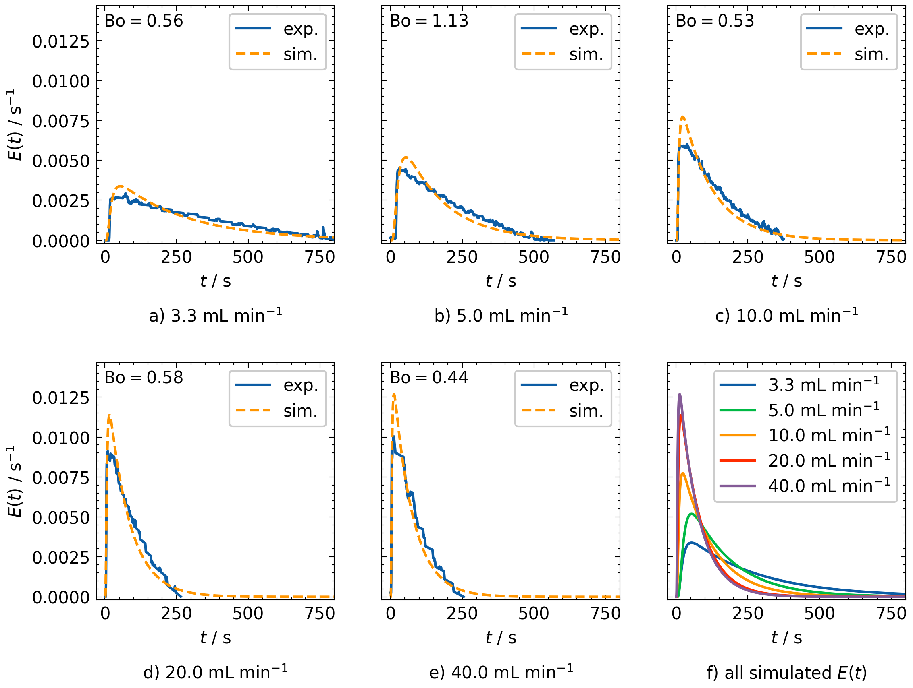
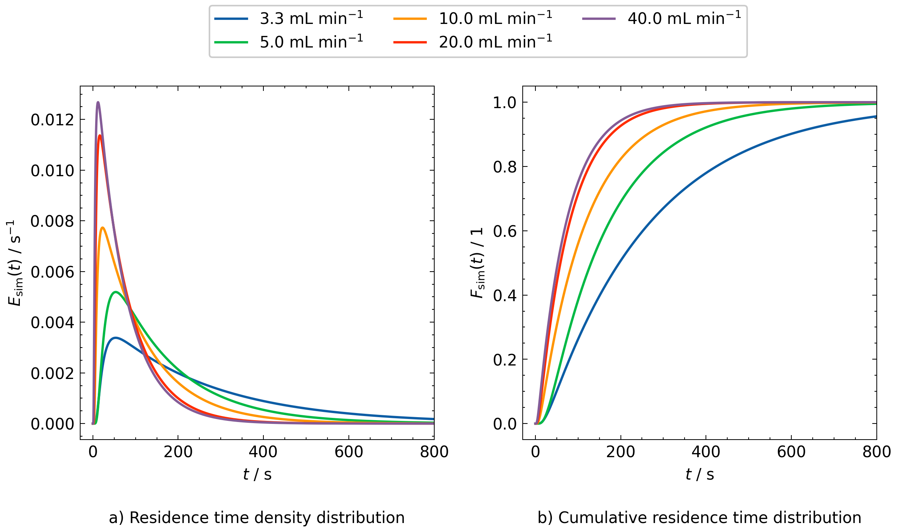

Residence Time Distribution Model Software Overview
===================================================================

Summary
-------

The Residence Time Distribution (RTD) model software is designed to analyze experimental RTD data obtained from the Falling Film Looping Photoreactor (FFLPR). It processes raw data files, fits an axial dispersion model to the experimental data, and calculates key parameters such as the mean residence time and Bodenstein number. It is available here: `RTD Model Software <02_Software/00_RTD_Model>`_.

Contents
--------

- ``00_Processed_Data/``: Processed and evaluated ``.csv`` files.
- ``01_Figures/``: Plots of the RTD analysis.
- ``main.ipynb``: Jupyter Notebook with RTD analysis code.

Installation
--------------

Install the required Python packages using:

.. code-block:: bash

    pip install --only-binary :all: -r requirements.txt

Requirements
--------------

- Python 3.11
- All required Python packages are listed in ``requirements.txt``.

Models and Equations
----------------------

To determine the Bodenstein number from the RTD experiments, an axial dispersion model with **closed–closed boundary conditions** [1]_ is fitted to the experimental data. The input signal is modeled as an ideal Dirac pulse, since injection time ≪ residence time.

The implementation is based on the ``rtdpy`` package [2]_. Detailed equations and boundary conditions can be found in the rtdpy documentation: https://merck.github.io/rtdpy/AxialDispersion_cc.html

The mean residence time :math:`\bar{\tau}` is calculated as the first moment of the experimental residence time density function :math:`E_{\mathrm{exp}}(t)`:

.. math::

    \bar{\tau} = \int_0^\infty t \cdot E_{\mathrm{exp}}(t) \, dt

Results
--------

The figures and table below summarize the results of the RTD analysis as a function of external flow rate.

Mean Residence Time and Bodenstein number
------------------------------------------

+---------------------------+------------------------------+--------------------------------------+------------------------+
| Flow Rate (mL min⁻¹)      | Mean Residence Time (s)      | Hydrodynamic Mean Residence Time (s) | Bodenstein Number (1)  |
+===========================+==============================+======================================+========================+
| 3.3                       | 272.02                       | 363.64                               | 0.56                   |
+---------------------------+------------------------------+--------------------------------------+------------------------+
| 5.0                       | 174.05                       | 240.00                               | 1.13                   |
+---------------------------+------------------------------+--------------------------------------+------------------------+
| 10.0                      | 119.29                       | 120.00                               | 0.53                   |
+---------------------------+------------------------------+--------------------------------------+------------------------+
| 20.0                      | 80.91                        | 60.00                                | 0.58                   |
+---------------------------+------------------------------+--------------------------------------+------------------------+
| 40.0                      | 73.21                        | 30.00                                | 0.44                   |
+---------------------------+------------------------------+--------------------------------------+------------------------+

Comparison of Experimental Data and Simulation
-----------------------------------------------

Simulated RTD Functions at Increasing Flow Rates
-------------------------------------------------

References
-----------

.. [1] O. Levenspiel, Chemical reaction engineering. Hauptbd., 3. ed, Wiley, New York Weinheim, 1999.
.. [2] Flamm, M. rtdpy: A python package for residence time distributions. Journal of Open Source Software, 4(40), 1621 (2019).
